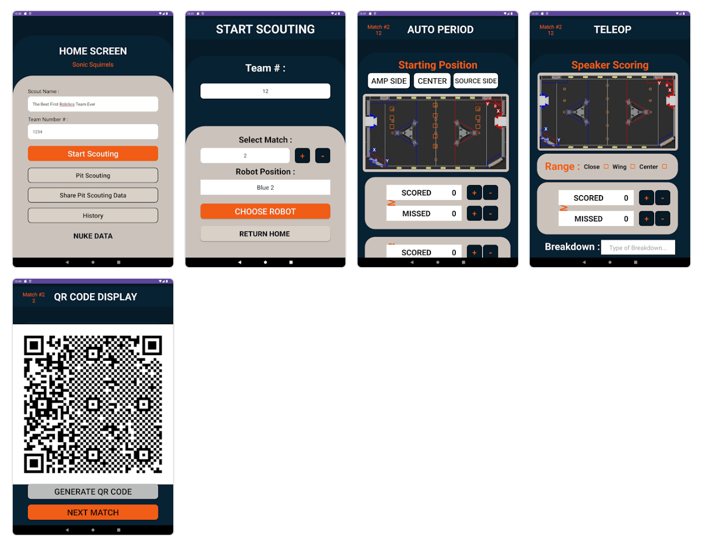

# Sonic Scout Apps

*Sonic Scout* is scouting software for First Robotics competitions.

*Sonic Squirrels* is a First Robotics team from Glacier Peak High School, Washington State, USA. Two high school juniors (Archit Kumar and Keyush Attarde) wrote the initial versions of the Sonic Scout software with some help from Diskuv. Keeping with the First Robotics value system, the software has been released for use by other robotics teams.

- [Sonic Scout Apps](#sonic-scout-apps)
  - [Overview](#overview)
  - [Official Releases](#official-releases)
  - [Customizing](#customizing)
    - [Quick Start for Customizers](#quick-start-for-customizers)
  - [Licenses](#licenses)

## Overview

In the **top right** there is a scout at a First Robotics competition entering information into an Android tablet (that source code is in [us/SonicScoutAndroid/](us/SonicScoutAndroid/)) and **on the laptop screen** you will see the scouting "manager" capturing a QR code from another scout who has completed their scouting; the QR scanning desktop "Manager" software lives in [us/SonicScoutBackend/](us/SonicScoutBackend/):


The picture is from a YouTube video (`Develop Cross-Platform Software using 2+ Languages @ 04:35`) describing the technical underpinnings of the Sonic Scout software:

[](https://www.youtube.com/watch?v=N9fVAIPMfKU)

The Android tablet has the following workflow (top left to bottom right) for a scout to record match information:



## Official Releases

Each year the First Robotics competitions change. The "official" release of the scouting software will always be **one year prior**. To be one step ahead of the other robotics teams, your team should [**modify** the scouting software](#customizing).

| File                                                                                                                                      | Description                                              |
| ----------------------------------------------------------------------------------------------------------------------------------------- | -------------------------------------------------------- |
| [`SonicScoutAndroid.apk`](https://github.com/diskuv/scoutapps/releases/download/2024.07.29/SonicScoutAndroid.apk)                         | The Android application. You will need to sideload it.   |
| [`SonicScoutBackend-1.0.0-win64.msi`](https://github.com/diskuv/scoutapps/releases/download/2024.07.29/SonicScoutBackend-1.0.0-win64.msi) | Windows installer for the QR scanning app and `sqlite3`. |
| [`SonicScoutQRScanner.dmg`](https://github.com/diskuv/scoutapps/releases/download/2024.07.29/SonicScoutQRScanner.dmg)                     | macOS QR scanning app.                                   |

<https://www.digitaltrends.com/mobile/how-to-sideload-an-apk/> has instructions how to sideload an Android application.

The Windows installer will install:

- a `SonicScoutBackend` folder in your Start Menu. You can launch the QR scanner from that (or just press the Windows key and start typing "Sonic Scout")
- a `sqlite3` database shell at `C:\Program Files\SonicScoutBackend\bin\sqlite3.exe`. The QR scanning database file will be in the folder `%LOCALAPPDATA%\sonic-scout` (copy that into File Explorer)

## Customizing

The expectation is that any First Robotics team that uses and modifies the scouting software will continue to uphold First Robotics values by contributing their modifications back to these projects. Keep your modifications to yourself for the first year, and then submit a Pull Request with your changes the second year.

It is inevitable that one robotics team may submit modifications that are in conflict with modifications from another robotics team. Unfortunately there can only be one official release, and only one app submitted to the Google and Apple App Stores. To keep a healthy ["copyleft" open-source license](#licenses) for use by all robotics teams, Diskuv will moderate and decide which modification becomes part of the official release *and* your team will be asked to sign a [Contributor License Agreement](https://www.apache.org/licenses/contributor-agreements.html).

### Quick Start for Customizers

> Prerequisite: A Windows 10 or Windows 11 PC with WSL installed. *Don't know if you have WSL? Follow <https://learn.microsoft.com/en-us/windows/wsl/install#install-wsl-command> which is safe even if WSL is already installed.*

If you haven't checked out this project onto your computer, you can do it now using **PowerShell on Windows**:

```powershell
# Windows setup
git -C C:\ clone https://github.com/diskuv/scoutapps.git
cd C:\scoutapps
```

or a **macOS terminal**:

```sh
# macOS setup
git clone https://github.com/diskuv/scoutapps.git
cd scoutapps
```

**Then** either ...

- in the same **PowerShell on Windows** or **macOS terminal** run the following to build and **run Android Studio** (where you can run the Android app):

  ```sh
  ./dk src/SonicScout_Setup/Develop.ml android
  ```

- **or** run the following to build and **run the QR scanner** (the Scout Backend):

  ```sh
  ./dk src/SonicScout_Setup/Develop.ml scanner
  ```

- **or** run the following to build and **query the QR scanner database**:

  ```sh
  ./dk src/SonicScout_Setup/Develop.ml database
  ```

When you are in Android Studio (`us/SonicScoutAndroid`) and you make a code change in
in the other software (like `us/SonicScoutBackend`), you should compile the entire project
so that your changes are visible:

```sh
./dk src/SonicScout_Setup/Develop.ml compile
```

After the end of the robotics season, you can save space by doing:

```sh
./dk src/SonicScout_Setup/Clean.ml --all
```

## Licenses

The source code of `Sonic Scout` is in the `src/` and `us/` folders are available
under the open source [OSL 3.0 license](./LICENSE-OSL3).

A guide to the Open Software License version 3.0 (OSL 3.0) is available at
<https://rosenlaw.com/OSL3.0-explained.htm>.

The `dk`, `dk.cmd` and `__dk.cmake` build tools are [OSL 3.0 licensed](./LICENSE-OSL3)
with prompts for additional licenses for the [LGPL 2.1 with an OCaml static linking exception](./LICENSE-LGPL21-ocaml) and the [DkSDK SOFTWARE DEVELOPMENT KIT LICENSE AGREEMENT](./LICENSE-DKSDK).

The backend app uses Qt5 which has a [LGPL 3.0 license](https://doc.qt.io/qt-5/licensing.html).

A DkSDK license token is necessary when you want to rebuild the applications with
customizations for your own robotics team. The token is free to any First Robotics team
who has an adult sponsor (ex. a mentor) who also agrees to submit their team's code changes at the end of each robotics season (a "pull request") using an open-source
[Contributor License Agreement](https://yahoo.github.io/oss-guide/docs/resources/what-is-cla.html).
You will be shown how to get a token when you run the commands in [Quick Start for Customizers](#quick-start-for-customizers).

You do *not* need a token to run the Android app from the Google Play Store, nor do you
need the license token to run the QR scanner backend app.

The copyright is owned jointly by:

- Archit Kumar
- Keyush Attarde
- Diskuv, Inc.

Do *not* submit a customized scouting application to an App Store (Apple, Google, Microsoft, Samsung, Huawei, Tencent, Oppo, etc.). You do not have a license to submit to those App Stores, and you don't own the copyright.

You *can* sideload your customized application on your team's tablets, phones and PCs.
