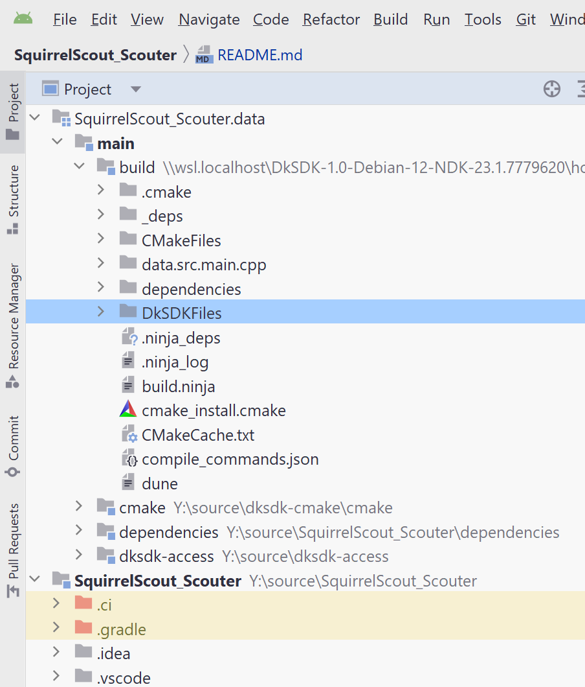

# Sonic Scout Android

## Official Releases

Each year the First Robotics competitions change.
The "official" release of the scouting software will always be one year prior.
To be one step ahead of the other robotics teams, your team should **modify** the scouting software.

This project is for the Android App `Sonic Scout` which is the official release in the Google Play Store.

## Licenses

The source code of `Sonic Scout Android` is in the `app/`, `data/`, `dependencies`, `dkconfig`,
and `publishing` folders are available under the open source [OSL 3.0 license](./LICENSE-OSL3).

A guide to the Open Software License version 3.0 (OSL 3.0) is available at
<https://rosenlaw.com/OSL3.0-explained.htm>.

The `dk`, `dk.cmd` and `__dk.cmake` build tools are [OSL 3.0 licensed](./LICENSE-OSL3)
with prompts for additional licenses for the [LGPL 2.1 with an OCaml static linking exception](./LICENSE-LGPL21-ocaml) and the [DkSDK SOFTWARE DEVELOPMENT KIT LICENSE AGREEMENT](./LICENSE-DKSDK).

A DkSDK license token is necessary when you want to rebuild the applications with
customizations for your own robotics team. The token is free to any First Robotics team
who has an adult sponsor (ex. a mentor) who also agrees to submit their team's code changes at the end of each robotics season (a "pull request") using an open-source
[Contributor License Agreement](https://yahoo.github.io/oss-guide/docs/resources/what-is-cla.html).
Contact jonah AT diskuv.com to get a token.

You do *not* need a token to run the Android app from the Google Play Store.

The copyright is owned jointly by:

- Archit Kumar
- Keyush Attarde
- Diskuv, Inc.

Do *not* submit a customized scouting application to an App Store (Apple, Google, Microsoft, Samsung, Huawei, Tencent, Oppo, etc.). You do not have a license to submit to those App Stores, and you don't own the copyright.

You *can* sideload your customized application on your team's tablets, phones and PCs.

## TODO - Command Line

### Initial Setup

> If you use Windows Subsystem for Linux (WSL2), follow [WSL2.md](./WSL2.md)
> before doing any of the following instructions.

FIRST you will need external source code. On Unix or Windows PowerShell (not Windows Command Prompt) run:

```shell
./dk dksdk.project.get
```

SECOND, if you want to do co-development of the data layer (the project is called `ocaml-backend`)
then checkout the `ocaml-backend` project *beside* your `SquirrelScout_Scouter` project.

So your directory structure should look like:

```text
~/source
├── ... any other projects you want ...
├── ocaml-backend
└── SquirrelScout_Scouter
```

THIRD, run the following commands in Unix or Windows PowerShell:

```sh
./dk dksdk.cmake.link QUIET
./dk dksdk.ninja.link
./dk dksdk.java.jdk.download NO_SYSTEM_PATH JDK 8
./dk dksdk.java.jdk.download NO_SYSTEM_PATH JDK 17
./dk dksdk.gradle.download ALL NO_SYSTEM_PATH
./dk dksdk.android.ndk.download NO_SYSTEM_PATH
./dk dksdk.android.gradle.configure OVERWRITE

git -C fetch/dksdk-ffi-java clean -d -x -f
./dk dksdk.gradle.run ARGS -p fetch/dksdk-ffi-java/core :abi:publishToMavenLocal :gradle:publishToMavenLocal
./dk dksdk.gradle.run ARGS -p fetch/dksdk-ffi-java :ffi-java:publishToMavenLocal -P "cmakeCommand=$PWD/.ci/cmake/bin/cmake" -P disableAndroidNdk=1
./dk dksdk.gradle.run ARGS -p fetch/dksdk-ffi-java :ffi-java-android:publishToMavenLocal -P "cmakeCommand=$PWD/.ci/cmake/bin/cmake" -P disableAndroidNdk=1
git -C fetch/dksdk-ffi-java clean -d -x -f
```

You can verify parts of the setup are working by running:

```sh
./dk dksdk.gradle.run ARGS -q javaToolchains
```

where you will see something like:

```text
 + Options
     | Auto-detection:     Enabled
     | Auto-download:      Enabled

+ Eclipse Temurin JDK 17.0.6+10
     | Location:           /home/YOURNAME/source/SquirrelScout_Scouter/.ci/local/share/jdk
     | Language Version:   17
     | Vendor:             Eclipse Temurin
     | Architecture:       amd64
     | Is JDK:             true
     | Detected by:        Gradle property 'org.gradle.java.installations.paths'
```

FINALLY, if you want to run Android Studio, run:

```shell
# One-time
./dk dksdk.android.studio.download NO_SYSTEM_PATH

# Each time
./dk dksdk.android.studio.run SCALE=2
```

### Android Studio

To make Android Studio speedier, you will want to go to `Actions` (Ctrl-Shift-A on Windows)
and then start typing and select `Check Ignored but not Excluded Directories`.

You may also experience time-consuming `Scanning index files`, `Loading symbols` and `Indexing` actions.
To avoid these in the future, right-click on any `\\wsl.localhost` based `build/DkSDKFiles` and `build/_deps` folders and **Mark Directory as Excluded**:



You can then restart Android Studio.

### Testing

```sh
./dk dksdk.gradle.run ARGS check
```

You should see a lot of output, but the end should look like:

```text
BUILD SUCCESSFUL in 1m 28s
43 actionable tasks: 43 executed
```

### Building

```sh
git clone git@gitlab.com:diskuv/distributions/1.0/dksdk-ffi-java.git
cd dksdk-ffi-java
./dk dksdk.gradle.run ARGS :core:abi:publishToMavenLocal :core:gradle:publishToMavenLocal
```

## TODO - Licenses

- The Cartman image is from https://dev.w3.org/SVG/tools/svgweb/samples/svg-files/
